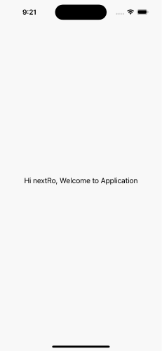

# Login Flow SwiftUI Mobile App Demo

This repository contains a sample SwiftUI mobile app with a login flow. The app demonstrates how to implement a login screen and perform UI testing using the UITest framework in Xcode.

## Features

- Login screen with userName and password fields
- Error handling for invalid login credentials
- Successful login redirecting to the main screen

## Screenshots




## Requirements

- Xcode 12 or later
- iOS 16.4 or later
- require pod on your machine 

## Installation

1. Clone this repository to your local machine.
2. Open Project on Ternimal and Install Pod.
3. Run 'Pod install' to create NextRootDemo.xcworkspace.
4. Open the Xcode project file (`NextRootDemo.xcworkspace`).
5. Build and run the app on a simulator or a physical device.

## Usage

1. Launch the app, and you will be presented with the login screen.
2. Enter your valid userName address and password.(Example -> userName:nextRo and password: A123456!a)
3. Tap the "Login" button to submit the credentials.
4. If the login is successful, you will be redirected to the main screen.
5. If the login fails, an error message will be displayed.

## UITest Code

The `NextRootDemoUITests` target contains the UI tests for the login flow. Here's an example of the UITest code to validate the login process:

```swift
import XCTest

final class NextRootDemoUITests: XCTestCase {
    let app = XCUIApplication()
   
    override func setUpWithError() throws {
        continueAfterFailure = false
        app.launch()
        
    }

    override func tearDownWithError() throws {
        // Put teardown code here. This method is called after the invocation of each test method in the class.
    }
    
    func testUserLoginForm() throws {
        let userLabel = UserLoginScreen.texts.userNameText
        XCTAssert(userLabel.exists)
        
        let passwordLabel = UserLoginScreen.texts.passwordText
        XCTAssert(passwordLabel.exists)
        
        let userName = UserLoginScreen.textEditors.userNameTextEditor
        XCTAssert(userName.exists)
        
        let securepasswordText = UserLoginScreen.textEditors.secureTextEditor
        XCTAssert(securepasswordText.exists)
        
        UserLoginScreen.buttons.passToggleButton.tap()
        
        let password = UserLoginScreen.textEditors.passwordTextEditor
        XCTAssert(password.exists)
        
       
        let toggleButoon = UserLoginScreen.buttons.passToggleButton
        XCTAssert(toggleButoon.exists)
        
        let userLoginButon = UserLoginScreen.buttons.loginButton
        XCTAssert(userLoginButon.exists)
    }

    func testLoginWithValidUsernameAndPassword() throws {
        UserLoginScreen.loginWithValidUsernameAndPassword()
        XCTAssert(UserLoginScreen.texts.welcomeText.waitForExistence(timeout: 5.0))
        let message = UserLoginScreen.texts.welcomeText.label
        XCTAssertEqual("Hi \(UserLoginScreen.userName), Welcome to Application", message)
    }
    
    func testLoginWithInvalidUsernameAndPassword() throws {
        UserLoginScreen.loginWithInvalidUsernameAndPassword()
        XCTAssertFalse(UserLoginScreen.texts.welcomeText.waitForExistence(timeout: 5.0))
    }
    
    func testInvalidLoginMessage() throws {
        UserLoginScreen.invalidLoginMessage()
        XCTAssert(app.alerts.element.waitForExistence(timeout: 5.0))
        app.alerts.element.buttons["Ok"].tap()
        XCTAssertFalse(app.alerts.element.exists)
    }
    
    func testLoginWithblankUsernameAndPassword() throws {
        UserLoginScreen.loginWithblankUsernameAndPassword()
        XCTAssert(app.alerts.element.waitForExistence(timeout: 5.0))
        app.alerts.element.buttons["Ok"].tap()
        XCTAssertFalse(app.alerts.element.exists)
    }
    
    func testcheckPasswordVisible() throws {
        UserLoginScreen.checkPasswordVisible()
        XCTAssert(UserLoginScreen.textEditors.passwordTextEditor.exists)
    }
    
    func testUserName() throws {
        UserLoginScreen.testUserName()
        XCTAssertNotEqual(UserLoginScreen.textEditors.userNameTextEditor.value as! String, "")
    }
    
    func testPassword() throws {
        UserLoginScreen.testPassword()
        XCTAssertNotEqual(UserLoginScreen.textEditors.secureTextEditor.value as! String, "")
    }
    
    func testUserNameValidate() throws {
        UserLoginScreen.buttons.loginButton.tap()
        XCTAssert(app.alerts.element.waitForExistence(timeout: 10))
        app.alerts.element.buttons["Ok"].tap()
        XCTAssertFalse(app.alerts.element.exists)
    }
    
    func testPasswordValidate() throws {
        UserLoginScreen.textEditors.userNameTextEditor.tap()
        UserLoginScreen.textEditors.userNameTextEditor.typeText("NextRo")
        
        UserLoginScreen.buttons.loginButton.tap()
        XCTAssert(app.alerts.element.waitForExistence(timeout: 10.0))
        app.alerts.element.buttons["Ok"].tap()
        XCTAssertFalse(app.alerts.element.exists)
    }

    func testLaunchPerformance() throws {
        if #available(macOS 10.15, iOS 13.0, tvOS 13.0, watchOS 7.0, *) {
            measure(metrics: [XCTApplicationLaunchMetric()]) {
                XCUIApplication().launch()
            }
        }
    }
}
```

Write test code using `Page Object Mode`. Here's an example of the UITest code `Page Object Mode` to validate the login process:

```swift
import XCTest

final class UserLoginScreen {
    
    static let userName = "nextRo"
    static let password = "A123456!a"
    static let wrongPassword = "A123486!a"
   
    struct Texts{
        let userNameText:XCUIElement
        let passwordText:XCUIElement
        let welcomeText:XCUIElement
    }
    
    struct TextEditors {
        let userNameTextEditor:XCUIElement
        let passwordTextEditor:XCUIElement
        let secureTextEditor:XCUIElement
    }
    
    struct Buttons {
        let passToggleButton:XCUIElement
        let loginButton:XCUIElement
    }
    
    static let texts = Texts(
        userNameText: XCUIApplication().staticTexts["userNameLabel"],
        passwordText: XCUIApplication().staticTexts["passwordLabel"],
        welcomeText: XCUIApplication().staticTexts["welcomeLabel"]
    )
    
    static let textEditors = TextEditors(
        userNameTextEditor: XCUIApplication().textFields["userNameText"],
        passwordTextEditor: XCUIApplication().textFields["passwordText"],
        secureTextEditor:XCUIApplication().secureTextFields["securepasswordText"]
    )
    
    static let buttons = Buttons(
        passToggleButton: XCUIApplication().buttons["passwordShowHide"],
        loginButton: XCUIApplication().buttons["loginButton"]
    )
    
    static func loginWithValidUsernameAndPassword(){
        UserLoginScreen.textEditors.userNameTextEditor.tap()
        UserLoginScreen.textEditors.userNameTextEditor.typeText(userName)
        
        UserLoginScreen.textEditors.secureTextEditor.tap()
        UserLoginScreen.textEditors.secureTextEditor.typeText(password)
        
        XCUIApplication().keyboards.buttons["Return"].tap()
        
        UserLoginScreen.buttons.loginButton.tap()
    }
    
    static func loginWithInvalidUsernameAndPassword(){
        UserLoginScreen.textEditors.userNameTextEditor.tap()
        UserLoginScreen.textEditors.userNameTextEditor.typeText(userName)
        
        UserLoginScreen.textEditors.secureTextEditor.tap()
        UserLoginScreen.textEditors.secureTextEditor.typeText(wrongPassword)
        
        XCUIApplication().keyboards.buttons["Return"].tap()
        
        UserLoginScreen.buttons.loginButton.tap()
    }
    
    static func loginWithblankUsernameAndPassword(){
        
        UserLoginScreen.textEditors.userNameTextEditor.tap()
        UserLoginScreen.textEditors.userNameTextEditor.typeText("")
        
        UserLoginScreen.textEditors.secureTextEditor.tap()
        UserLoginScreen.textEditors.secureTextEditor.typeText("")
            
        UserLoginScreen.buttons.loginButton.tap()
        
    }
    
    static func invalidLoginMessage(){
        
        UserLoginScreen.textEditors.userNameTextEditor.tap()
        UserLoginScreen.textEditors.userNameTextEditor.typeText(userName)
        
        UserLoginScreen.textEditors.secureTextEditor.tap()
        UserLoginScreen.textEditors.secureTextEditor.typeText(wrongPassword)
        
        XCUIApplication().keyboards.buttons["Return"].tap()
        
        UserLoginScreen.buttons.loginButton.tap()
        
    }
    
    static func checkPasswordVisible(){
        UserLoginScreen.textEditors.secureTextEditor.tap()
        UserLoginScreen.textEditors.secureTextEditor.typeText(password)
        UserLoginScreen.buttons.passToggleButton.tap()
    }
    
    static func testUserName(){
        UserLoginScreen.textEditors.userNameTextEditor.tap()
        UserLoginScreen.textEditors.userNameTextEditor.typeText(userName)
    }
    
    static func testPassword(){
        UserLoginScreen.textEditors.secureTextEditor.tap()
        UserLoginScreen.textEditors.secureTextEditor.typeText(password)
    }
}
```

## Contributing

Contributions are welcome! If you find any issues or have suggestions for improvements, feel free to open a pull request or create an issue.
